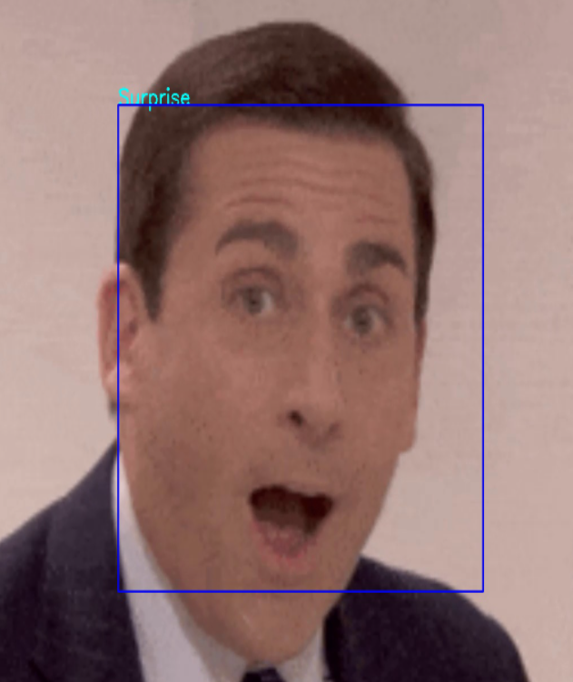

# Facial-Expression-Recognition-Applied
This project is my attempt at applying what I learned from the [Facial Expression Recognition](https://www.coursera.org/learn/facial-expression-recognition-keras/home/welcome) course. I use the notes and skills I picked up from the course to 'accurately' depict the facial expressions of my friends, family, and favorite tv-show characters. 

I loved the process of building this app because, although I have a huge passion for machine learning, I had no idea of where to start. This machine learning application allowed me to use my personal interests (family, friends, and relateble characters) as a sample for my aspirations. 

Instructions: If you would like to use this application, clone the files (via the green Code button), throw your desired video into the "videos" folder, and change the path to the video in the camera.py file. Run a terminal/bash, cd into the folder containing "main.py" and run "python main.py".

Objective: Build a machine learning application to 'square' faces in a video and identify the expression created by that face. 

Process 1: The aforementioned Coursera course contained over 30,000 images that I used as a sample dataset for training the model. The images were split into training sets and datasets.

Process 2: After splitting the data into training and testing sets, I split the sets into 7 folders depending on what expression the image contained. The folder names contained the output labels.  

Process 3: I created Convolutional Neural Networks using 4 layers, explicitly changing the amount of filters in each layer (64, 128, and 512) throughout the ConvNet. Each layer was given a BatchNormalization(), relu Activation, 2x2 pool size, and 0.25 Dropout. Lastly, the model was flattened after building the ConvNet layers. 

Process 4: Each ConvNet Layer was then connected using Dense layers. There were 3 connected layers, which ended with a 'softmax' output layer as the output should be categorical. This method also selected an Adam optimizer. 

